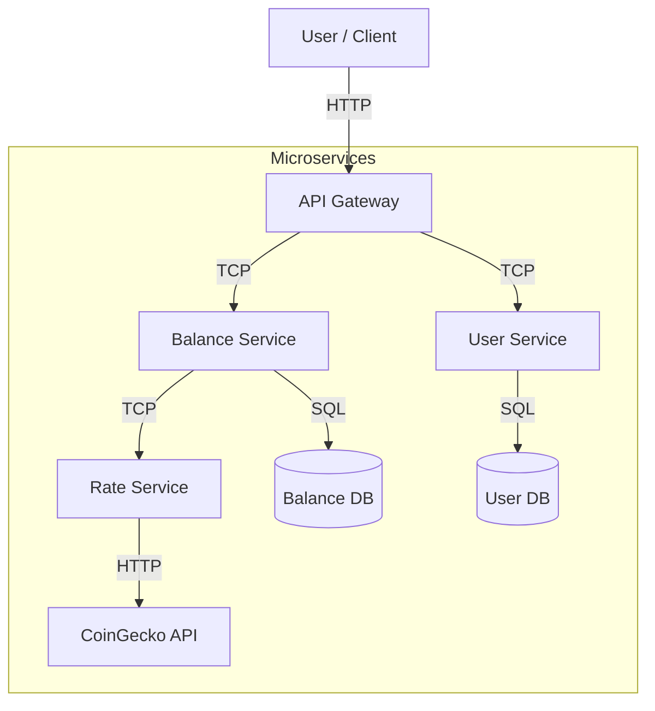

# Crypto Wallet System Knowledge Base

## 1. Project Overview
The **Crypto Wallet System** is a microservices-based application that allows users to manage their cryptocurrency holdings, view current valuations, and perform portfolio rebalancing. It is built using **NestJS** and allows for scalable, distributed development.

## 2. High-Level Architecture
The system follows a microservices architecture, orchestrated by an **API Gateway**. Services communicate via **TCP** using NestJS Microservices.

### Tech Stack
-   **Framework**: NestJS (Monorepo)
-   **Language**: TypeScript
-   **Databases**: PostgreSQL (with TypeORM)
-   **Containerization**: Docker & Docker Compose
-   **Caching**: in-memory (and potential for Redis)
-   **API Documentation**: Swagger (OpenAPI)
-   **External API**: CoinGecko (for crypto rates)

### Service Interaction


## 3. Microservices Breakdown

### A. API Gateway (`apps/api-gateway`)
-   **Port**: 3000
-   **Role**: Entry point for all HTTP requests. Handles authentication (JWT), request validation, and routing to appropriate microservices.
-   **Key Features**:
    -   **Global Prefix**: `/api/v1`
    -   **Swagger UI**: Available at `/api`
    -   **Security**: Uses `helmet`, `throttler` (rate limiting).
    -   **Auth**: Implements JWT Guards to protect endpoints.

### B. Balance Service (`apps/balance`)
-   **Port**: 3001
-   **Role**: Manages user portfolios (assets and amounts).
-   **Database**: `balances_db` (PostgreSQL)
-   **Key Entities**:
    -   `Asset`: `id`, `search_id` (e.g., 'bitcoin'), `name`, `symbol`.
    -   `Balance`: `id`, `user_id`, `asset_id` (FK), `amount` (decimal).
-   **Key Logic**:
    -   **Add/Remove Asset**: Updates user holdings.
    -   **Rebalance**: Adjusts holdings to match target percentages of total portfolio value.
    -   **Valuation**: Communicates with *Rate Service* to get current prices.

### C. Rate Service (`apps/rate`)
-   **Port**: 3002
-   **Role**: Provides current exchange rates for cryptocurrencies.
-   **External Integration**: **CoinGecko API** (`/simple/price`).
-   **Caching Strategy**:
    -   Caches rates in-memory to reduce external API calls.
    -   **Cache Tiers**: returning 'all', 'partial', or 'none' cached.
    -   **Cron Job**: Updates rates and cache for configured high-demand assets daily at midnight.

### D. User Service (`apps/user`)
-   **Port**: 3003
-   **Role**: Manages user accounts and authentication.
-   **Database**: `users_db` (PostgreSQL)
-   **Key Features**:
    -   User registration and login.
    -   Password hashing (bcrypt).
    -   JWT token generation.

## 4. Setup & Running

### Prerequisites
-   Node.js & npm
-   Docker & Docker Compose

### Environment Setup
Each app requires a `.env` file in its root (`apps/<app-name>/.env`).
See `.env.example` in each directory for required keys (e.g., `DB_HOST`, `DB_PASSWORD`, `COINGECKO_API_KEY`).

### Running with Docker (Recommended)
This spins up all services and databases:
```bash
docker compose up --build
```
-   **API Gateway**: http://localhost:3000
-   **Swagger Docs**: http://localhost:3000/api
-   Note: Place `password.txt` files in `apps/*/db/` for DB secrets if using Docker secrets.

### Running Locally (Manual)
1.  **Install dependencies**: `npm install`
2.  **Start Databases**: Ensure local Postgres instances are running for `users_db` and `balances_db`.
3.  **Start Services**:
    ```bash
    npm start api-gateway
    npm start balance
    npm start rate
    npm start user
    ```

## 5. Key Workflows

### 1. Portfolio Rebalancing (`PUT /balance/rebalance`)
1.  User sends target percentages for their assets (e.g., Bitcoin 60%, Ethereum 40%).
2.  **Gateway** forwards request to **Balance Service**.
3.  **Balance Service** fetches current prices from **Rate Service**.
4.  Calculates total portfolio value.
5.  Determines required amount for each asset to meet target %.
6.  Updates `amount` in `Balance` table to reflect new holdings (logic simulation).

### 2. Rate Fetching
1.  **Balance Service** requests rates for specific asset IDs.
2.  **Rate Service** checks cache.
3.  If cache miss/stale, calls **CoinGecko API**.
4.  Returns rates and updates cache.

## 6. Project Structure
-   `apps/`: Contains the microservices source code.
-   `libs/shared/`: Shared code (DTOs, Interfaces, Decorators, Utils) used across all apps to ensure consistency.
    -   `dto/`: Data Transfer Objects for validation.
    -   `interfaces/`: TypeScript interfaces.
    -   `general/`: Constants (Routes, MessagePatterns).
