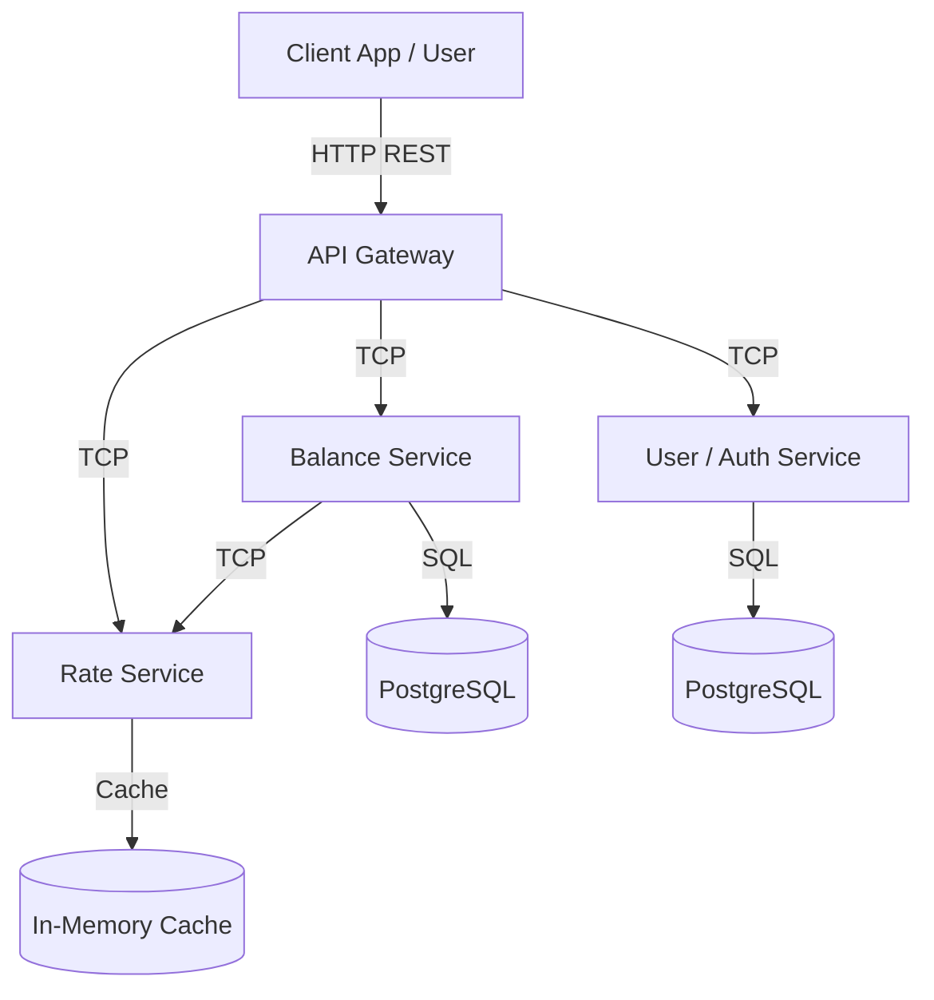

# System Architecture

## Overview

The **Crypto Balance System** is a microservices-based application built with **NestJS**. It is designed to demonstrate a modular architecture for managing cryptocurrency holdings and fetching real-time exchange rates.

## Technology Stack

### Core

- **Framework**: [NestJS](https://nestjs.com/) (Node.js) - Chosen for its modularity and native support for microservices.
- **Language**: TypeScript - Ensures type safety and better developer experience.
- **Monorepo**: Managed via NestJS CLI standard workspace.

### Data & Communication

- **Database**: PostgreSQL - Primary data store, accessed via **TypeORM**.
- **Caching**: NestJS In-Memory Cache - Used for caching exchange rates to reduce external API calls.
- **Inter-Service Communication**: TCP (Transmission Control Protocol) - Efficient transport for internal microservice communication.
- **Client Communication**: HTTP (REST) - Exposed via the API Gateway.

### Infrastructure

- **Containerization**: Docker & Docker Compose.
- **Authentication**: JWT (JSON Web Tokens) via Passport strategy.

## High-Level Architecture

The system is composed of an API Gateway and several backend microservices:

## Directory Structure

The project follows a standard NestJS monorepo structure:

- **`apps/`**: Contains the source code for each microservice.
  - `api-gateway`: entry point.
  - `user`: handles identity and profiles.
  - `balance`: handles crypto portfolio logic.
  - `rate`: handles fetching and caching external rates.
- **`libs/`**: Contains shared code.
  - `shared`: DTOs, interfaces, and utilities used across multiple apps.
- **`dist/`**: Compiled output.
